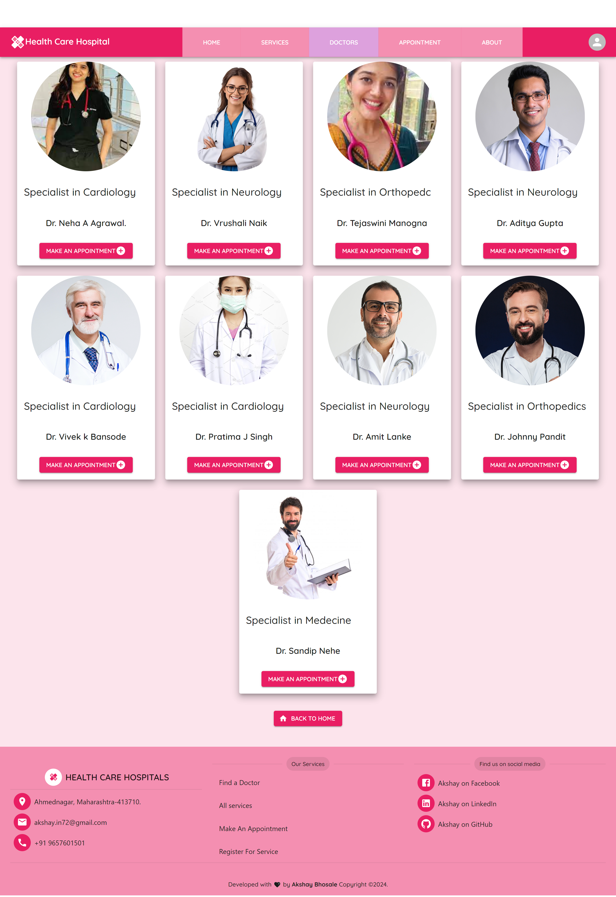

Project Live preivew link ►https://healthcaress.netlify.app/ website This project is based on a Healthcare hospitalsservice in this project and the technology is used here is react js.

In this site we have these features and services

    𝟏-𝐑𝐞𝐬𝐩𝐨𝐧𝐬𝐢𝐯𝐞 𝐍𝐚𝐯𝐛𝐚𝐫
    𝟐-𝐮𝐬𝐞𝐫 𝐍𝐚𝐯𝐢𝐠𝐚𝐭𝐢𝐨𝐧
    𝟑-𝐀𝐮𝐭𝐡𝐞𝐧𝐭𝐢𝐜𝐚𝐭𝐢𝐨𝐧 𝐬𝐲𝐬𝐭𝐞𝐦 𝐟𝐨𝐫 𝐥𝐨𝐠𝐢𝐧 𝐚𝐧𝐝 𝐫𝐞𝐠𝐢𝐬𝐭𝐞𝐫
    𝟒-𝐜𝐚𝐫𝐨𝐮𝐬𝐞𝐥 𝐟𝐨𝐫 𝐚𝐝𝐯𝐞𝐫𝐭𝐢𝐬𝐞𝐦𝐞𝐧𝐭
    𝟓-𝐒𝐞𝐫𝐯𝐢𝐜𝐞𝐬 𝐥𝐢𝐬𝐭 𝐚𝐧𝐝 𝐢𝐦𝐚𝐠𝐞𝐬 𝐰𝐢𝐭𝐡 𝐝𝐞𝐭𝐚𝐢𝐥𝐬
    𝟔-𝐃𝐨𝐜𝐭𝐨𝐫𝐬 𝐥𝐢𝐬𝐭
    𝟕-𝐀𝐩𝐩𝐨𝐢𝐧𝐭𝐦𝐞𝐧𝐭 𝐩𝐚𝐠𝐞
    𝟖-𝐑𝐞𝐬𝐩𝐨𝐧𝐬𝐢𝐯𝐞 𝐅𝐨𝐨𝐭𝐞𝐫
    𝟗- 𝐟𝐢𝐫𝐞𝐛𝐚𝐬𝐞 𝐀𝐮𝐭𝐡𝐞𝐧𝐭𝐢𝐜𝐚𝐭𝐢𝐨𝐧

The Package uses in this project:

    1-𝕸𝖆𝖙𝖊𝖗𝖎𝖆𝖑 𝖀𝖎
    2-𝕽𝖊𝖆𝖈𝖙 𝕽𝖔𝖚𝖙𝖊𝖗
    3-𝕱𝖎𝖗𝖊𝖇𝖆𝖘𝖊 𝕬𝖚𝖙𝖍𝖊𝖓𝖙𝖎𝖈𝖆𝖙𝖎𝖔𝖓 𝖆𝖓𝖉 𝖍𝖔𝖘𝖙𝖎𝖓𝖌
    4-𝕰𝖒𝖔𝖙𝖎𝖔𝖓 𝖈𝖔𝖗𝖊
    5-𝕽𝖊𝖆𝖈𝖙 𝕳𝖆𝖘𝖍 𝖑𝖎𝖓𝖐
    6-𝕸𝖆𝖙𝖊𝖗𝖎𝖆𝖑 𝖀𝕴 𝖈𝖆𝖗𝖔𝖚𝖘𝖊𝖑
    7-@𝖒𝖚𝖎/𝖑𝖆𝖇
    8-𝖉𝖆𝖙𝖊-𝖋𝖓𝖘
    9-𝕽𝖊𝖆𝖈𝖙 𝖘𝖜𝖆𝖑 𝖆𝖑𝖊𝖗𝖙
    10-𝕽𝖊𝖆𝖈𝖙 𝕲𝖔𝖔𝖌𝖑𝖊 𝕭𝖚𝖙𝖙𝖔𝖓

                                                         𝒅𝒆𝒎𝒐 𝒊𝒎𝒂𝒈𝒆𝒔► 
 Home page Desktop
                                       

Login Page Desktop
                                        

Service Page Desktop
                                        
                                                        Home page Mobile

 Doctors Page Desktop
                                        

About page Desktop
                                        

Appointment page Desktop
                                        

Home mobile                                                        
_home.png>)

                                                       
                                                         Login Page Mobile
_login.png>)

                                                         Register  Page Mobile
_login_register.png>)

                                                       

Service Page Mobile
_services.png>)

                                                           

Docter Page Mobile                                                           
_docter.png>)
                                                           
                                                           

Appointment page Mobile                                                           
_appointment.png>)
                                                           
                                                          

                                                           About page mobile 
_about.png>)

                                                        
                                     -----------------𝑨𝒅𝒅𝒊𝒕𝒊𝒐𝒏𝒂𝒍 𝒊𝒏𝒇𝒐-----------------
                                     
                                     Getting Started with Create A Health Cares App By using following steps
                                     This project was bootstrapped with Reactjs framework.
                                     
                                     Available Scripts
                                     In the project directory, you can run:
                                     
                                     git init
                                     git clone https://github.com/akshybhosale/health_cares
                                     
                                     Install a npm packages and Material UI bootstrapped packages
                                     npm start
                                     Runs the app in the development mode.
                                     Open http://localhost:3000 to view it in your browser.
                                     
                                     npm run build
                                     Builds the app for production to the build folder.
                                     It correctly bundles React in production mode and optimizes the build for the best performance.
                                     
                                     The build is minified and the filenames include the hashes.
                                     Your app is ready to be deployed!
                                     
                                     Deploy YourS project on Netlify
                                     https://app.netlify.com/sites/healthcaress/deploys/6597fa8603256b000891f758
                                     
                                     See the section about deployment for more information.

                                                        

                                                        
